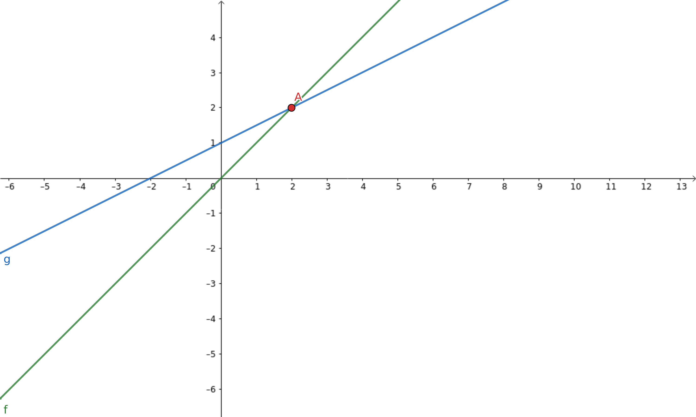

## Getting Started

You can install LunesPy using:

    pip install lunespy

## Documentation

The library is driven-transactions on the *lunesnode* architecture.

The transaction concept here will be any type of interaction with the lunes blockchain.

In this way, we can create a transaction to transfer tokens, a transaction to create tokens, a transaction to create a nickname (alias) for our account, etc.

## Generate a Wallet

A `Wallet` is `Account` like an `email account`, which instead of having `address@provider` and `password` has:
- seed
- network
- nonce
- private key
- public key
- address

The wallet can be generated for `testnet` or `mainnet`. **This will only change the address**

You can generate a wallet passing your `seed`, `private_key`, `public_key`, `address` as **parameters** or none of nothing like that to generate a new one.

Changing the `nonce` is possible generate `4,294,967,295` different wallets with only a `seed`.

**Exemple code**
```python
from lunespy.client.wallet import Account

# Generating Wallet
new_wallet = Account()
print(new_wallet)

# Saving your wallet as .json
new_wallet.to_json(path="./")
```

```py
[output]:

seed
 └── "roast mother supply match result breeze canoe immune spike vague poverty apology found ivory reward"
nonce
 └── 0
network
 └── mainnet
private key
 └── "EUMUHS8StgpYPkNFVLC1yucioN1WAEXLA16XbaTc4i7g"
public key
 └── "8oo2AThLJtRwhBrwsZgdHtZfPpAp2bKhcLT11FbvL6xr"
address
 └── "37p2LHMx3WP3n2thAyBeP3wzidiEmKxjxU9"

"Your wallet has been saved in `./wallet.json`"
```


## Send Lunes

Only for send `Lunes` asset **you dont must be pass `asset_id` parameter** in `TranferToken`.

If your Transfer successful, the data will ben saved in .json with a name as `transfer-YOUR_TX_ID.json`

The transfer costs **`0.001Lunes`**


**Exemple code**
```python
from lunespy.client.transactions.transfer import TransferToken
from lunespy.client.wallet import Account

# Generate the wallets
seed = "My_seed"
my_wallet = Account(seed=seed, network="testnet", nonce=0)
random_wallet = Account(network="testnet")

# Set up the transaction to send your Lunes
tx = TransferToken(my_wallet, random_wallet, amount=100)

# Returns `True` if the data passed is valid
print(tx.ready)

# Returns the transaction mounted before sending
print(tx.transaction)

# Send a transfer transaction
print(tx.send())
# Your Transaction has been sended and saved in `./transaction-DFh451K5ot7J8sjobVsrMcAQiFnRESXG6C19UnKsS5Mi.json`

# Shows all sent transfers
print(tx.history)
```

**If successful**
```json
[
  {
    "ready": true,
    "senderPublicKey": "4SpyrKC8KFq2AF2RjgS6o373vTFrAAwrFmMfYL8PfezE",
    "signature": "4jD1B37yewcwedSZ6gt8LeVPY8f2i4tn8VjrnhNukCkpTrvm1e5YtrH7Byzj7rYTbB9dMzKzdL5P1E7xR7N89zp9",
    "timestamp": 1631473467403,
    "recipient": "37ani1re8pMVYRkHo1xDPtj8kBYyDu3DGkP",
    "feeAsset": "",
    "assetId": "",
    "amount": 100,
    "type": 4,
    "fee": 100000,
    "send": true,
    "response": {
      "type": 4,
      "id": "DFh451K5ot7J8sjobVsrMcAQiFnRESXG6C19UnKsS5Mi",
      "sender": "37bpECMv85nUr14YEfkyyyWKN2gYgrCfDhX",
      "senderPublicKey": "FYvp88jP2xC21JCQfeSxUkg6qmLSGs5x8TBr5V3pT2NH",
      "fee": 100000,
      "timestamp": 1631473695599,
      "signature": "2VwHiMtN2CUqJuMiaGqhsM1Qorhz7jMbjGb5wxN9Hb7WnLZXAwPPTEYjht8Ey8FjDt8739EFnuSvwMiwioqJ3XXd",
      "recipient": "37hqrPGmzzT6xk5GFXbc9u5yYnRmBWSJuTY",
      "assetId": null,
      "amount": 100,
      "feeAsset": null
    }
  }
]
```

**If failed**
```json
[
  {
    "ready": true,
    "senderPublicKey": "4SpyrKC8KFq2AF2RjgS6o373vTFrAAwrFmMfYL8PfezE",
    "signature": "4jD1B37yewcwedSZ6gt8LeVPY8f2i4tn8VjrnhNukCkpTrvm1e5YtrH7Byzj7rYTbB9dMzKzdL5P1E7xR7N89zp9",
    "timestamp": 1631473467403,
    "recipient": "37ani1re8pMVYRkHo1xDPtj8kBYyDu3DGkP",
    "feeAsset": "",
    "assetId": "",
    "amount": 100,
    "type": 4,
    "fee": 100000,
    "send": false,
    "response": {
      "error": 112,
      "message": "State check failed. Reason: Attempt to transfer unavailable funds: Transaction application leads to negative lunes balance to (at least) temporary negative state, current balance equals 0, spends equals -100100, result is -100100",
      "tx": {
        "type": 4,
        "id": "EzQVTZGavd9jmWprnADWMK3dya8ZeF1dAF4JNYmAkkH1",
        "sender": "37QqvghNGWrUWSjALayGjCnT1nC28wXV6pL",
        "senderPublicKey": "4SpyrKC8KFq2AF2RjgS6o373vTFrAAwrFmMfYL8PfezE",
        "fee": 100000,
        "timestamp": 1631473467403,
        "signature": "4jD1B37yewcwedSZ6gt8LeVPY8f2i4tn8VjrnhNukCkpTrvm1e5YtrH7Byzj7rYTbB9dMzKzdL5P1E7xR7N89zp9",
        "recipient": "37ani1re8pMVYRkHo1xDPtj8kBYyDu3DGkP",
        "assetId": null,
        "amount": 100,
        "feeAsset": null
      }
    }
  }
]
```

## Issue your Token

**Brief description of what Tokens, Assets and NFTs are**

- **Token** are representations of something real or not, such as identity, value, product, etc...
- **Asset** are tokens that represent some value, which can be fractionable.
- **NFT** are a type of token, non-fractional, that represents the intellectual property of something, such as music, video, photo, etc.

Your parameter `name` must be more than 4 and less than 16 characters.

You can choose how many tokens to create by changing the `quantity` parameter.

The `decimal` parameter can be useful to fractionate your token.

Putting `True` in the `reissuable` parameter will allow you to issue more of the same asset in the future.

The issue Token costs **`1Lunes`**

**Exemple code**
```python
from lunespy.client.wallet import Account
from lunespy.client.transactions.issue import IssueToken, IssueAsset, IssueNFT


# Generate the wallet
seed = "Your Seed"
my_wallet = Account(seed=seed, network="testnet")


# Information of issue your new token
token_info = {
  "name": "MyFlat",
  "description": "sharing quotes from my apartment",
  "quantity": 100,
  "decimals": 0,
  "reissueable": False
}


# Information of issue your new asset
asset_info = {
  "name": "MyDolar",
  "description": "Asset backed in dolar",
  "quantity": 20000,
  "decimals": 2,
  "reissueable": False
}


# Information of issue your new nft
nft_info = {
  "name": "Eleanor",
  "description": "Tokenizing my Ford Mustang Shelby GT500 1967",
  "quantity": 1,
  "decimals": 0,
  "reissueable": False
}


# Set up the transaction to issue your token
issue = IssueToken(my_wallet, **token_info)

# OR Set up the transaction to issue your Asset
issue = IssueAsset(my_wallet, **asset_info)

# OR Set up the transaction to issue your IssueNFT
issue = IssueNFT(my_wallet, **nft_info)


# Returns `True` if the data passed is valid
print(tx.ready)

# Returns the transaction mounted before sending
print(tx.transaction)

# Send a issue transaction
print(tx.send())

# Shows all sent issued
print(tx.history)
```

## Send your Tokens

By passing an `asset_id` parameter it is possible to send any asset that has already been `issued` in lunes-blockchain

The transfer costs **`0.001Lunes`**

```python
from lunespy.client.transactions.transfer import TransferToken
from lunespy.client.wallet import Account

# Generate the wallet
seed = "My_seed"
my_wallet = Account(seed=seed, network="testnet", nonce=0)
random_wallet = Account(network="testnet")

# Get Asset or Token ID
token = "9ax6usn3TmwdTRoTnn8zr5Kku9qykstYxRkUb4Z1Z2oY"

# Set up the transaction to transfer your tokens
tx = TransferToken(my_wallet, random_wallet, amount=100, asset_id=token)

# Send a transfer transaction
tx.send()
print(tx.history)
```
**Successful**
```json
[
  {
    "ready": true, 
    "senderPublicKey": "FYvp88jP2xC21JCQfeSxUkg6qmLSGs5x8TBr5V3pT2NH",
    "signature": "4DbDKGpykZ6we8VckTNGCeVFhLgiFaaDobcbjXi5vy7wupbxLUMtnkhwRc2HmdGctFTm8URZ8bzVEwxPgbofCzWT",
    "timestamp": 1631475869750,
    "recipient": "37cefY8nWHhBTkFLSiSdNyDSg6n9e7G5DF2",
    "feeAsset": "",
    "assetId": "9ax6usn3TmwdTRoTnn8zr5Kku9qykstYxRkUb4Z1Z2oY",
    "amount": 100,
    "type": 4,
    "fee": 100000,
    "send": true,
    "response": {
      "type": 4,
      "id": "B31BCDgKGr1bisKChb3LF1mL3Wfb1Yaqkvwiv9MargzR",
      "sender": "37bpECMv85nUr14YEfkyyyWKN2gYgrCfDhX",
      "senderPublicKey": "FYvp88jP2xC21JCQfeSxUkg6qmLSGs5x8TBr5V3pT2NH",
      "fee": 100000,
      "timestamp": 1631475869750,
      "signature": "4DbDKGpykZ6we8VckTNGCeVFhLgiFaaDobcbjXi5vy7wupbxLUMtnkhwRc2HmdGctFTm8URZ8bzVEwxPgbofCzWT",
      "recipient": "37cefY8nWHhBTkFLSiSdNyDSg6n9e7G5DF2",
      "assetId": "9ax6usn3TmwdTRoTnn8zr5Kku9qykstYxRkUb4Z1Z2oY", 
      "amount": 100,
      "feeAsset": null
    }
  }
]
```

## Reissue your Token or New Asset
 
If you set `reissuable` to `True` at your Token, Asset or NFT creation time you can issue more of that same Token, Asset or NFT

**Example code**
```python
from lunespy.client.wallet import Account
from lunespy.client.transactions.reissue import ReissueToken, ReissueAsset, ReissueNFT


# Generate the wallet
seed = "Your Seed"
my_wallet = Account(seed=seed, network="testnet")

token_info = {
    'asset_id': 'YOUR_TOKEN_ID',
    'quantity': 5500,
    'reissuable': True
}

# Set up the transaction to reissue more of your Token
issue = ReissueToken(my_wallet, **token_info)

# Returns `True` if the data passed is valid
print(tx.ready)

# Returns the transaction mounted before sending
print(tx.transaction)

# Send a reissue transaction
print(tx.send())

# Shows all sent reissued
print(tx.history)
```

## Burn your Token or New Asset

Maybe you want to decrease the amount of Tokens you created.
For that, you can use the BurnToken, BurnAsset or BurniNG class

```python
from lunespy.client.wallet import Account
from lunespy.client.transactions.burn import BurnToken


# Generate the wallet
seed = "Your Seed"
my_wallet = Account(seed=seed, network="testnet")

token_info = {
    'asset_id': 'YOUR_TOKEN_ID',
    'quantity': 5000
}

# Set up the transaction to burn more of your Token
issue = BurnToken(my_wallet, **token_info)

# Returns `True` if the data passed is valid
print(tx.ready)

# Returns the transaction mounted before sending
print(tx.transaction)

# Send a burn transaction
print(tx.send())

# Shows all sent burned
print(tx.history)
```

## Create your Lease

Users can **leasing** their `lunes` to a [LunesNode](https://github.com/Lunes-platform/LunesNode) and get a portion of the LunesNode payment as a reward, without losing full control over their `lunes` in their accounts.

When the user starts **leasing** the tokens, those leased tokens are blocked and remain at the same address with full control of their owner.

The only thing to consider when **leasing** is choosing the right LunesNode operator, as the operator can work efficiently and send different percentages as a reward.

**Exemple code**
```python
from lunespy.client.wallet import Account
from lunespy.client.transactions.lease import CreateLease


# Generate the wallet
seed = "Your Seed"
my_wallet = Account(seed=seed, network="testnet")

token_info = {
    'node_address': 'ADDRESS_OF_A_LUNESNODE',
    'amount': 5000
}

# Set up the transaction to lease more of your Token
issue = CreateLease(my_wallet, **token_info)

# Returns `True` if the data passed is valid
print(tx.ready)

# Returns the transaction mounted before sending
print(tx.transaction)

# Send a lease transaction
print(tx.send())

# Shows all sent leased
print(tx.history)
```

## Cancel your Lease

For Cancel your lease

**Exemple code**
```python
from lunespy.client.wallet import Account
from lunespy.client.transactions.cancel import CancelLease


# Generate the wallet
seed = "Your Seed"
my_wallet = Account(seed=seed, network="testnet")

token_info = {
    'lease_tx_id': 'TRANSACTION_ID_OF_YOUR_LEASE',
}

# Set up the transaction to cancel more of your Token
issue = CancelLease(my_wallet, **token_info)

# Returns `True` if the data passed is valid
print(tx.ready)

# Returns the transaction mounted before sending
print(tx.transaction)

# Send a cancel transaction
print(tx.send())

# Shows all sent canceled
print(tx.history)
```


## Create Alias for your Address

Alias is a short, easy-to-remember `address` name, the alias is unique on the blockchain, an address can have multiple aliases.
Alias can be used in place of address, the alias cannot be deleted.

**Example code**
```python
from lunespy.client.wallet import Account
from lunespy.client.transactions.alias import CreateAlias


# Generate the wallet
seed = "Your Seed"
my_wallet = Account(seed=seed, network="testnet")


# Set up the transaction to create a alias for your account
issue = CreateAlias(my_wallet, alias='brazil_lunes')

# Returns `True` if the data passed is valid
print(tx.ready)

# Returns the transaction mounted before sending
print(tx.transaction)

# Send a alias transaction
print(tx.send())

# Shows all sent alias
print(tx.history)
```

## Send MassTransfer of Lunes

With the feature of sending **mass transfers** it is possible to save time and money.
The total cost for this type of transaction is given by `0.001 + 0.0005 * n`, where `n` is the number of total transactions, it is possible to make up to 100 transfers in just 1 transaction.

Compared to common transfers:

Tx | MassTransfer | Transfer 
--- | ---  | ---  |
1    | 0.0015  | 0.0010
2    | 0.0020  | 0.0020
3    | 0.0025  | 0.0030
... |... |... |
98   | 0.0050  |  0.0098
99   | 0.0055  |  0.0099
100  | 0.0051  |  0.0100



**Example code**
```python
from lunespy.client.wallet import Account
from lunespy.client.transactions.mass import MassTransferToken

sender = Account(
    seed="whip wave witness family famous hundred dog east inner brief develop intact retreat result coyote",
    nonce=1,
    network='testnet')


list_of_address = [
    {'receiver': '37TVfJowBmXGLPaMvTDZFRMq1Ng1mEjDGPj', 'amount': 100}, 
    {'receiver': '37Xr3Pyo7iF66Nwtty5wFjU5m7mJTZArg2b', 'amount': 100},
    {'receiver': '37Ua2WqMK5nejKi49AGNhpVX638i3iDHYhV', 'amount': 100},
    {'receiver': '37Vj7YmwS2VLxe5McLt3ki1byTbqcLj7o8A', 'amount': 100},
    {'receiver': '37aUDmQ7Y64dNYwjnW6cMgN7fvyKC6wQBuM', 'amount': 100}
]

tx = MassTransferToken(sender, list_of_address)
tx.send()
```
## Send MassTransfer of any Assets

It is also possible to use this transfer type to send any type of tokens by passing the `asset_id` parameter

**Example code**
```python
from lunespy.client.wallet import Account
from lunespy.client.transactions.mass import MassTransferToken
from lunespy.client.transactions.issue import IssueToken

sender = Account(
    seed="whip wave witness family famous hundred dog east inner brief develop intact retreat result coyote",
    network='testnet')

token_data = {
    "description": "My new Token",
    "reissuable": False,
    "quantity": 100000,
    "decimals": 0,
    "name": "NewToken",
}
tx_issue = IssueToken(sender, **token_data)
tx_issue.send("http://127.0.0.1:5555")

token_id = tx_issue.history[0]['response']['assetId']
z

list_of_address = [
    {'receiver': '37TVfJowBmXGLPaMvTDZFRMq1Ng1mEjDGPj', 'amount': 100}, 
    {'receiver': '37Xr3Pyo7iF66Nwtty5wFjU5m7mJTZArg2b', 'amount': 100},
    {'receiver': '37Ua2WqMK5nejKi49AGNhpVX638i3iDHYhV', 'amount': 100},
    {'receiver': '37Vj7YmwS2VLxe5McLt3ki1byTbqcLj7o8A', 'amount': 100},
    {'receiver': '37aUDmQ7Y64dNYwjnW6cMgN7fvyKC6wQBuM', 'amount': 100}
]

tx = MassTransferToken(sender, list_of_address, asset_id=token_id)
tx.send("http://127.0.0.1:5555")
```

## Exchange

```python
Comming Soon...
```
asset_id